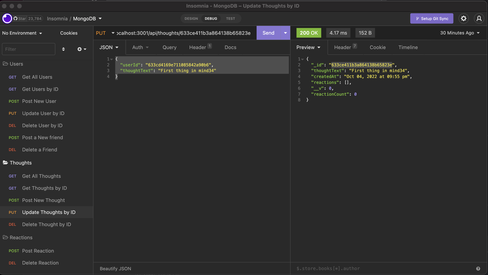
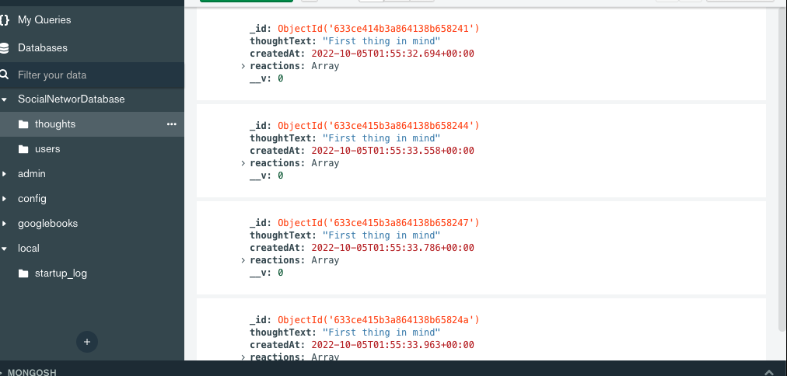

# 18SocialNetAPI
Social Network API with MongoDB


# Description
Social Network API for MongoDB and test it with Insomnia. 
add users and thoughts using REST communication and MongoDB Models 

## How to Use 18SocialNetAPI

1. **Clone the Repository**
2. **run npm i**
3. **Run the App with npm start**
4. **Use Insomnia to make CRUD REST with this parameters**

```
Get all users
http://localhost:3001/api/users

Get user by ID example
http://localhost:3001/api/users/633cd02bb1810404e4d7e1f5

Post new user Example
http://localhost:3001/api/users

Update User by ID Example
http://localhost:3001/api/users/633cd02bb1810404e4d7e1f5

Delete user by ID Example
http://localhost:3001/api/users/633cd02bb1810404e4d7e1f5

Post a New Friend Example
http://localhost:3001/api/users/633cd4169e711085842a90b6/friends/633cd43b9e711085842a90b8

Delete a Friend Example
http://localhost:3001/api/users/633cd4169e711085842a90b6/friends/633cd43b9e711085842a90b8

Get all Thoughts
http://localhost:3001/api/thoughts

Get thoughts by ID
http://localhost:3001/api/thoughts/633ce415b3a864138b658247

Post new thought
http://localhost:3001/api/thoughts

Update thoughts by ID
http://localhost:3001/api/thoughts/633ce411b3a864138b65823e

Delete thoughts by ID 
http://localhost:3001/api/thoughts/633ce411b3a864138b65823e


````


## Screenshoots
Overview


Overview2


## Conclusion 

 Thank you to all the GTBootcamp staff for all the support and teaching that makes this possible.

 ## License
[MIT](https://choosealicense.com/licenses/mit/)